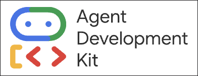
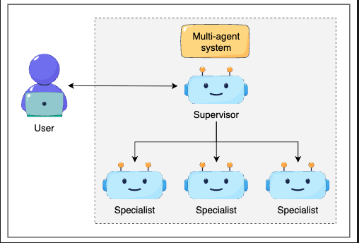

# Building AI agent using Google ADK

## Introduction

This repository provides a comprehensive guide to building intelligent AI agents using Google's Agent Development Kit (ADK). Whether you're a beginner looking to understand the fundamentals of AI agents or an experienced developer ready to deploy production-grade solutions, this course covers everything you need.

### What You'll Learn

- **Fundamentals**: Understand the core concepts and architecture of AI agents
- **Agent Development**: Learn how to design and build agents with Google ADK
- **Integration**: Discover how to integrate agents with external APIs and services
- **Optimization**: Master techniques for improving agent performance and reliability
- **Deployment**: Deploy and manage your AI agents in production environments
- **Advanced Topics**: Explore cutting-edge patterns and best practices for enterprise-scale AI solutions

This repo includes hands-on examples, code samples, and practical projects that will help you master building AI agents from concept to deployment.

### Why do we need a dedicated agent development framework?

- **Standardization & Consistency**: Frameworks provide standardized patterns and best practices, ensuring that AI agents are built consistently across teams and projects.

- **Abstraction of Complexity**: They abstract away low-level implementation details, allowing developers to focus on business logic rather than infrastructure concerns like message routing, state management, and error handling.

- **Built-in Safety & Reliability**: Frameworks include built-in mechanisms for error handling, logging, monitoring, and safety guardrails that ensure agents behave predictably and securely.

- **Interoperability**: They enable seamless integration with external systems, APIs, and services through standardized interfaces and connectors.

- **Performance & Scalability**: Optimized frameworks handle concurrency, resource management, and scaling challenges automatically, so your agents can handle production workloads.

- **Development Speed**: Pre-built components, middleware, and tools dramatically reduce development time and allow you to iterate faster.

- **Maintainability**: Standardized code structure and patterns make it easier to maintain, debug, and collaborate on agent projects across teams.

- **Enterprise Features**: Frameworks provide production-ready features like authentication, authorization, audit logging, and compliance support.

### What is the Google ADK?

Google Agent Development Kit (ADK) is a comprehensive framework designed to simplify the creation, deployment, and management of AI agents at scale. It provides a unified platform with pre-built components, APIs, and tools that enable developers to build intelligent, autonomous agents that can understand context, make decisions, and interact seamlessly with external systems and services.

### Multi-Agent Systems

Multi-agent systems involve coordinating multiple AI agents to work together toward common goals, enabling complex problem-solving that goes beyond what a single agent can achieve. In a multi-agent system, agents communicate, collaborate, and coordinate their actions to handle sophisticated tasks, distribute workloads, and provide specialized expertise across different domains.

Google ADK provides robust support for building and managing multi-agent systems through several key capabilities:

- **Agent Orchestration**: Built-in tools for coordinating multiple agents, managing their interactions, and ensuring they work in harmony toward shared objectives.

- **Inter-Agent Communication**: Standardized messaging protocols that allow agents to communicate efficiently, share information, and coordinate their actions seamlessly.

- **Centralized Coordination**: A coordination layer that enables agents to synchronize workflows, handle dependencies, and manage complex multi-step processes across the system.

- **Scalable Architecture**: Support for deploying and scaling multiple agents across distributed infrastructure, allowing your multi-agent system to grow as needed.

- **State Management**: Tools for managing shared state and context across agents, ensuring consistency and coherence in multi-agent operations.

- **Monitoring & Analytics**: Comprehensive visibility into multi-agent interactions, performance metrics, and system health across all agents.

### Google ADK Tool Ecosystem

Google ADK provides a rich and extensible tool ecosystem that enables agents to perform a wide variety of tasks and integrate with external systems. This flexible approach allows you to build powerful agents tailored to your specific needs:

- **Custom Python Functions**: Define and integrate custom Python functions directly into your agents, allowing you to encapsulate business logic, perform computations, or implement domain-specific operations seamlessly.

- **Built-in Tools**: Leverage a comprehensive library of pre-built tools provided by Google ADK, including utilities for data processing, text manipulation, mathematical operations, and common integration patterns.

- **Agents as Tools**: Compose agents hierarchically by using agents as tools for other agents, enabling modular design and creating specialized sub-agents that handle specific tasks or domains.

- **Third-Party Integrations**: Connect seamlessly with external services and APIs through pre-built integrations with popular platforms, databases, and cloud services, extending your agent's capabilities beyond the framework.

### Deterministic Orchestration: Workflow Agents

Google ADK provides deterministic orchestration capabilities through specialized workflow agents that enable predictable, structured execution of complex tasks. These agents ensure that tasks execute in a controlled manner with clear dependencies and execution patterns:

- **Sequential Agent**: Executes tasks in a strict linear order, where each task completes before the next one begins. This is ideal for workflows where steps have dependencies and must run one after another, such as data validation followed by processing followed by storage.

- **Parallel Agent**: Executes multiple tasks simultaneously to improve efficiency and reduce overall execution time. This agent is perfect for independent tasks that don't depend on each other, allowing your workflow to take advantage of concurrent processing and handle multiple operations at once.

- **Loop Agent**: Repeatedly executes tasks based on specified conditions or iterations, enabling the processing of collections, retries, or recurring workflows. This agent handles batch operations, iterative refinement, and any scenario where tasks need to be repeated until a condition is met.
