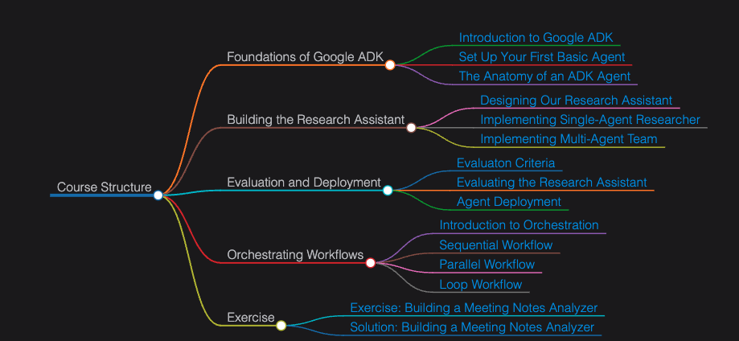
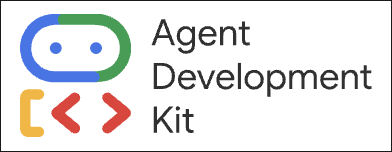
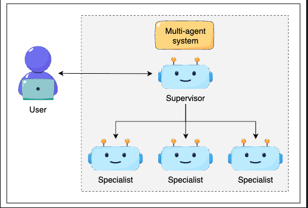
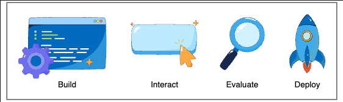
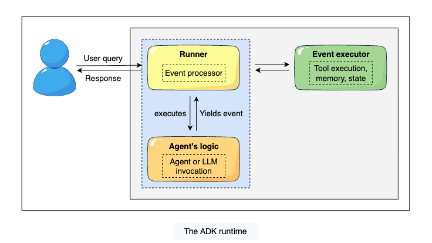
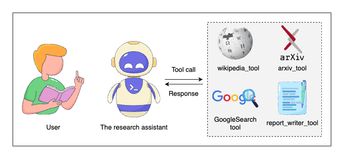
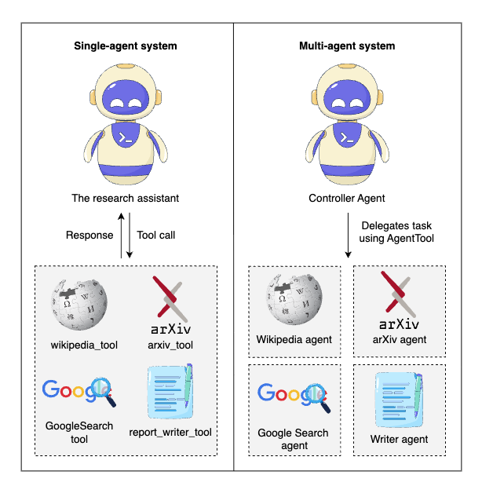
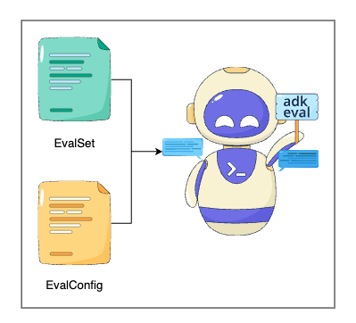

# Building AI agent using Google ADK



## Introduction

This repository provides a comprehensive guide to building intelligent AI agents using Google's Agent Development Kit (ADK). Whether you're a beginner looking to understand the fundamentals of AI agents or an experienced developer ready to deploy production-grade solutions, this course covers everything you need.

### What You'll Learn

- **Fundamentals**: Understand the core concepts and architecture of AI agents
- **Agent Development**: Learn how to design and build agents with Google ADK
- **Integration**: Discover how to integrate agents with external APIs and services
- **Optimization**: Master techniques for improving agent performance and reliability
- **Deployment**: Deploy and manage your AI agents in production environments
- **Advanced Topics**: Explore cutting-edge patterns and best practices for enterprise-scale AI solutions

This repo includes hands-on examples, code samples, and practical projects that will help you master building AI agents from concept to deployment.

### Why do we need a dedicated agent development framework?

- **Standardization & Consistency**: Frameworks provide standardized patterns and best practices, ensuring that AI agents are built consistently across teams and projects.

- **Abstraction of Complexity**: They abstract away low-level implementation details, allowing developers to focus on business logic rather than infrastructure concerns like message routing, state management, and error handling.

- **Built-in Safety & Reliability**: Frameworks include built-in mechanisms for error handling, logging, monitoring, and safety guardrails that ensure agents behave predictably and securely.

- **Interoperability**: They enable seamless integration with external systems, APIs, and services through standardized interfaces and connectors.

- **Performance & Scalability**: Optimized frameworks handle concurrency, resource management, and scaling challenges automatically, so your agents can handle production workloads.

- **Development Speed**: Pre-built components, middleware, and tools dramatically reduce development time and allow you to iterate faster.

- **Maintainability**: Standardized code structure and patterns make it easier to maintain, debug, and collaborate on agent projects across teams.

- **Enterprise Features**: Frameworks provide production-ready features like authentication, authorization, audit logging, and compliance support.

### What is the Google ADK?

Google Agent Development Kit (ADK) is a comprehensive framework designed to simplify the creation, deployment, and management of AI agents at scale. It provides a unified platform with pre-built components, APIs, and tools that enable developers to build intelligent, autonomous agents that can understand context, make decisions, and interact seamlessly with external systems and services.



### Multi-Agent Systems

Multi-agent systems involve coordinating multiple AI agents to work together toward common goals, enabling complex problem-solving that goes beyond what a single agent can achieve. In a multi-agent system, agents communicate, collaborate, and coordinate their actions to handle sophisticated tasks, distribute workloads, and provide specialized expertise across different domains.

Google ADK provides robust support for building and managing multi-agent systems through several key capabilities:

- **Agent Orchestration**: Built-in tools for coordinating multiple agents, managing their interactions, and ensuring they work in harmony toward shared objectives.

- **Inter-Agent Communication**: Standardized messaging protocols that allow agents to communicate efficiently, share information, and coordinate their actions seamlessly.

- **Centralized Coordination**: A coordination layer that enables agents to synchronize workflows, handle dependencies, and manage complex multi-step processes across the system.

- **Scalable Architecture**: Support for deploying and scaling multiple agents across distributed infrastructure, allowing your multi-agent system to grow as needed.

- **State Management**: Tools for managing shared state and context across agents, ensuring consistency and coherence in multi-agent operations.

- **Monitoring & Analytics**: Comprehensive visibility into multi-agent interactions, performance metrics, and system health across all agents.



### Google ADK Tool Ecosystem

Google ADK provides a rich and extensible tool ecosystem that enables agents to perform a wide variety of tasks and integrate with external systems. This flexible approach allows you to build powerful agents tailored to your specific needs:

- **Custom Python Functions**: Define and integrate custom Python functions directly into your agents, allowing you to encapsulate business logic, perform computations, or implement domain-specific operations seamlessly.

- **Built-in Tools**: Leverage a comprehensive library of pre-built tools provided by Google ADK, including utilities for data processing, text manipulation, mathematical operations, and common integration patterns.

- **Agents as Tools**: Compose agents hierarchically by using agents as tools for other agents, enabling modular design and creating specialized sub-agents that handle specific tasks or domains.

- **Third-Party Integrations**: Connect seamlessly with external services and APIs through pre-built integrations with popular platforms, databases, and cloud services, extending your agent's capabilities beyond the framework.

### Deterministic Orchestration: Workflow Agents

Google ADK provides deterministic orchestration capabilities through specialized workflow agents that enable predictable, structured execution of complex tasks. These agents ensure that tasks execute in a controlled manner with clear dependencies and execution patterns:

- **Sequential Agent**: Executes tasks in a strict linear order, where each task completes before the next one begins. This is ideal for workflows where steps have dependencies and must run one after another, such as data validation followed by processing followed by storage.

- **Parallel Agent**: Executes multiple tasks simultaneously to improve efficiency and reduce overall execution time. This agent is perfect for independent tasks that don't depend on each other, allowing your workflow to take advantage of concurrent processing and handle multiple operations at once.

- **Loop Agent**: Repeatedly executes tasks based on specified conditions or iterations, enabling the processing of collections, retries, or recurring workflows. This agent handles batch operations, iterative refinement, and any scenario where tasks need to be repeated until a condition is met.

### Agent Lifecycle

The agent lifecycle encompasses the complete journey of an AI agent from conception to production operation. Google ADK supports a well-defined lifecycle with four key phases that guide you through developing and managing robust agents:

- **Build**: Design and implement your agent with the necessary tools, logic, and capabilities. This phase involves defining the agent's behavior, integrating tools and APIs, configuring parameters, and setting up the foundation for intelligent decision-making. You'll write code, test components, and establish the core architecture of your agent.

- **Interact**: Deploy the agent in a controlled environment to test its interactions and behavior with real-world scenarios. This phase allows you to understand how the agent responds to various inputs, how it communicates, and how it handles edge cases. Collect feedback and user interactions to validate that the agent behaves as expected.

- **Evaluate**: Assess the agent's performance against predefined metrics and success criteria. This phase involves analyzing the agent's decision quality, accuracy, response times, and user satisfaction. Use monitoring tools and analytics to identify bottlenecks, failures, and areas for improvement before full production deployment.

- **Deploy**: Release the agent to production where it serves real users and handles actual workloads. This phase includes setting up monitoring, logging, and alerting to ensure the agent continues to perform well. Implement safeguards, compliance checks, and rollback procedures to maintain reliability and safety in a live environment.



### Model Agnostic & Deployment Agnostic

Google ADK is designed with flexibility in mind, allowing you to build agents that are independent of specific AI models and deployment infrastructure. This approach provides significant benefits for long-term sustainability and adaptability:

**Model Agnostic**:
- **Flexibility with LLMs**: Work with any large language model—whether it's Google's Gemini, OpenAI's GPT, Anthropic's Claude, or open-source models. Your agent code remains consistent regardless of which model you choose.
- **Easy Model Switching**: Replace or upgrade your underlying model without rewriting agent logic, allowing you to take advantage of newer, more capable models as they become available.
- **Multi-Model Support**: Combine multiple models in a single agent, using specialized models for different tasks based on their strengths and capabilities.

**Deployment Agnostic**:
- **Cloud Flexibility**: Deploy your agents on Google Cloud, AWS, Azure, or on-premises infrastructure without changing your code. The framework abstracts away deployment complexities.
- **Multiple Runtime Options**: Run agents in serverless environments, containerized services, VMs, or edge devices—choose the deployment model that best fits your requirements.
- **Infrastructure Independence**: Your agent code remains decoupled from underlying infrastructure, enabling seamless migration between deployment environments as your needs evolve.

### ADK Runtime

**Role and the Event Loop**

The Runner's primary role is to manage the event loop, which is the fundamental pattern governing how ADK executes an agent's code. This is a cooperative, back-and-forth communication cycle:

1. The Runner receives a user's query.
2. It kicks off the agent's logic.
3. The agent's logic runs until it needs to communicate something—like a final answer, a request to call a tool, or a change in state. At this point, the agent's code pauses and yields an Event object back to the Runner.
4. The Runner receives this Event, processes it (e.g., executes a requested tool or commits a state change), and forwards the result upstream.
5. Only after the Runner has finished processing the event, it signals the agent's logic to resume from exactly where it left off, now aware of the outcome of the event.

This cooperative **yield → pause → process → resume** cycle is the heartbeat of the ADK runtime. It ensures that actions like tool calls and state updates are handled consistently and that the agent is always working with the most up-to-date information.



## Building a Research Agent

We'll build a research agent step by step, exploring three architectural patterns of increasing complexity. The first pattern we'll implement is the **Monolithic Agent**.

### Pattern 1: Monolithic Agent



A **monolithic agent** is an architectural pattern where a single, central `LlmAgent` contains all the logic and is responsible for orchestrating all the necessary tools to complete a task.

This is a powerful and effective starting point, as it consolidates the entire workflow's logic in one place, making it easier to reason about and implement.

#### Architecture

A monolithic agent's architecture consists of two primary components:

- **The Brain** — the instruction prompt that defines the agent's goals, behavior, and reasoning strategy
- **The Capabilities** — the tools the agent has at its disposal to act on the world

In our research agent, the agent is given a set of tools it can call as needed to complete a research task:

- `wikipedia_tool` — fetches background knowledge and summaries on topics
- `arxiv_tool` — searches academic papers and research literature
- `GoogleSearch_tool` — performs live web searches for up-to-date information
- `report_writer_tool` — compiles findings into a structured, readable report

The agent decides autonomously which tools to call, in what order, and how to combine the results to fulfill the user's request.

#### How It Works

1. The user submits a research query to the agent.
2. The agent reasons about the query and decides which tool to call first.
3. It calls the tool and receives a response.
4. Based on that response, it decides whether to call another tool or synthesize the results.
5. Once it has gathered enough information, it uses the `report_writer_tool` to produce a final report and returns it to the user.

#### When to Use the Monolithic Pattern

The monolithic pattern is ideal when:

- The task scope is well-defined and can be managed by a single agent
- You want simplicity — one agent, one prompt, all tools in one place
- You are prototyping and want to validate the workflow before introducing more complex multi-agent architectures

#### Limitations

As tasks grow in complexity, a single agent managing everything can become harder to maintain, debug, and scale. Each tool call adds to the context window, and the agent may struggle with very long workflows. These are the motivations for the more advanced patterns we'll explore next.

### Pattern 2: Controller Pattern (Multi-Agent)



To move beyond the monolithic approach, we adopt a common and powerful multi-agent architecture known as the **controller pattern**. In this design, responsibilities are split between two types of agents:

- **Controller agent** (also known as an orchestrator or manager) — the primary point of contact for the user. Its job is not to perform tasks itself, but to understand the user's request and delegate it to the appropriate specialist.
- **Worker agents** — each is an expert in a single, specific task (e.g., searching Wikipedia, querying arXiv, writing a report).

#### The Agent-as-a-Tool Pattern

The key mechanism that makes this work is the **Agent-as-a-Tool** pattern. Each worker agent is wrapped in an `AgentTool` class, which makes the entire agent — with its own model, instructions, and tools — behave like a single callable tool that the controller can invoke.

This means the controller's instruction prompt is no longer a multi-step research plan. Instead, it becomes a routing directive: understand the request, identify the right specialist, and delegate.

#### Architecture

| Component | Role |
|---|---|
| `controller_agent` | Receives user query, decides which worker to call |
| `wikipedia_agent` | Wraps `wikipedia_tool`, handles encyclopedic lookups |
| `arxiv_agent` | Wraps `arxiv_tool`, handles academic paper searches |
| `report_writer_agent` | Wraps `report_writer_tool`, compiles the final report |

#### How It Works

1. The user submits a research query to the controller agent.
2. The controller reasons about the query and delegates to the appropriate worker agent via `AgentTool`.
3. The worker agent executes its task using its own tools and returns a result.
4. The controller may delegate to additional workers as needed.
5. Once all information is gathered, the controller delegates to the `report_writer_agent` to produce the final output.

#### Advantages Over the Monolithic Pattern

- **Separation of concerns** — each agent has a focused, well-defined responsibility
- **Easier to debug** — failures are isolated to a specific worker agent
- **Scalable** — new capabilities can be added by introducing new worker agents without modifying existing ones
- **Context efficiency** — each worker operates in its own context window, reducing the risk of context overload in complex workflows

## Evaluating Your Agent

Once your agent is built, you need a systematic way to measure how well it performs. Google ADK provides a rich suite of built-in evaluation criteria, each designed to measure a different facet of an agent's performance.



Evaluation in ADK is driven by two inputs:

- **EvalSet** — a collection of test cases, each containing an input query and the expected output or behavior
- **EvalConfig** — a configuration file that specifies which evaluation criteria to apply and how to score them

These are passed to `adk eval`, which runs the agent against the EvalSet and scores it according to the EvalConfig.

### LLM-as-a-Judge

Many of the built-in criteria use a powerful **LLM-as-a-Judge** approach, where a separate LLM is used to score the agent's responses against a set of rules. This provides a nuanced, semantic assessment that goes far beyond simple string matching — the judge can assess tone, completeness, factual accuracy, and reasoning quality.

### Evaluation Criteria

ADK's evaluation criteria are grouped by what they measure:

**Response Quality**
- `response_match_score` — measures how closely the agent's final response matches the expected answer, using semantic similarity rather than exact string matching
- `response_evaluation_score` — uses LLM-as-a-Judge to rate the response quality against a custom rubric (e.g., clarity, accuracy, completeness)

**Tool Use**
- `tool_call_match` — checks whether the agent called the correct tools (exact match)
- `tool_trajectory_avg_score` — evaluates the sequence of tool calls the agent made across the entire conversation, rewarding efficient and correct tool usage patterns

**Safety & Groundedness**
- `safety` — uses LLM-as-a-Judge to flag responses that contain harmful, offensive, or policy-violating content
- `groundedness` — checks whether the agent's response is grounded in the retrieved context and does not hallucinate information

### Running Evaluations

```bash
adk eval <agent_module> <evalset_file> --config <evalconfig_file>
```

Evaluation results are reported per-criterion, giving you a clear picture of where your agent excels and where it needs improvement — making it an essential step before deploying to production.
